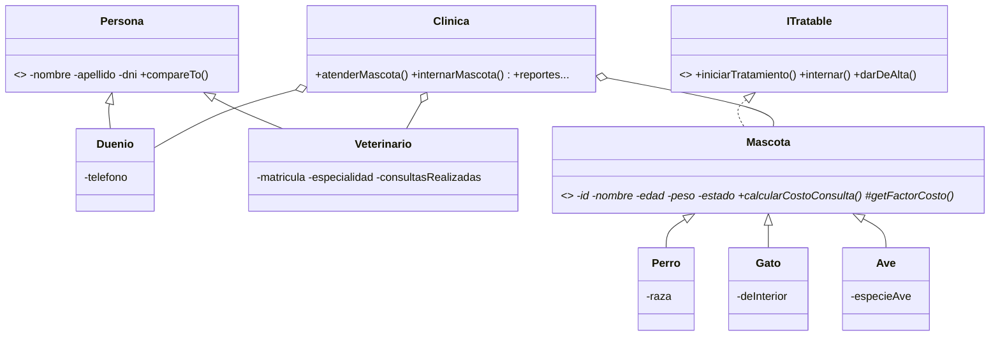

# Sistema de Clínica Veterinaria

Aplicación de consola en **Java 17+** para gestionar una clínica veterinaria: registro de dueños, veterinarios y mascotas (perros, gatos y aves), consultas con costo variable según la especie, internaciones, reportes y persistencia de datos entre ejecuciones.

## Qué incluye

| Concepto | Dónde se ve |
|---|---|
| **Herencia y clases abstractas** | `Persona` → `Duenio`, `Veterinario` · `Mascota` → `Perro`, `Gato`, `Ave` |
| **Polimorfismo** | Cada especie define su propio recargo en `getFactorCosto()`; `calcularCostoConsulta()` funciona igual para todas |
| **Interfaces** | `ITratable` (ciclo de vida de una mascota) e `IRepositorio<T>` (persistencia) |
| **Genéricos** | `RepositorioArchivo<T>` es una sola clase que persiste cualquier entidad |
| **Excepciones propias** | `EstadoInvalidoException`, `EntidadNoEncontradaException`, `EntidadDuplicadaException` |
| **Máquina de estados** | `SANA → EN_TRATAMIENTO → INTERNADA → SANA`, con transiciones inválidas rechazadas |
| **Collections** | `HashMap`, `List`, `TreeMap`, `Comparable` (`Persona.compareTo`) |
| **Streams y lambdas** | Filtros, orden, `groupingBy`, `averagingInt`, `summingDouble` en `Clinica` |
| **Records** | `Consulta` es un `record` inmutable |
| **Serialización** | Los datos se guardan en `datos/*.dat` y se recuperan al reiniciar |
| **Separación en capas** | La lógica (`servicio`) no imprime ni lee de consola; la interfaz (`app`) sí |
| **Pruebas** | `PruebasClinica` verifica reglas de negocio y persistencia, sin librerías externas |

## Estructura

```
src/
├── app/          Main.java                 → menú de consola
├── servicio/     Clinica.java              → lógica de negocio y reportes
├── modelo/       Persona, Duenio, Veterinario,
│                 Mascota, Perro, Gato, Ave,
│                 Consulta, EstadoMascota
├── interfaces/   ITratable, IRepositorio<T>
├── repositorio/  RepositorioArchivo<T>     → persistencia genérica
└── excepciones/  3 excepciones propias
test/
└── PruebasClinica.java
```

## Diagrama de clases (simplificado)



## Reglas de negocio

- Una mascota solo puede registrarse si su dueño ya existe (por DNI).
- No se puede registrar dos veces el mismo DNI (dueños) ni la misma matrícula (veterinarios).
- Una mascota **internada** no puede recibir una nueva consulta hasta que se le dé el alta.
- No se puede internar a una mascota ya internada, ni dar de alta a una que está sana.
- Recargos sobre el costo base de la consulta: **perros de más de 25 kg +20 %**, **aves +30 %**, gatos sin recargo.
- Si una operación falla, no se registra nada (no quedan consultas "a medias").

## Cómo ejecutarlo

Requisito: **JDK 17 o superior** (`java -version` y `javac -version` para comprobarlo).

Desde la raíz del proyecto:

```bash
# 1. Compilar
mkdir bin
javac -d bin -sourcepath src src/app/Main.java

# 2. Ejecutar
java -cp bin app.Main
```

> En el primer arranque la clínica está vacía: usá la opción **11** del menú para cargar datos de ejemplo.

### Correr las pruebas

```bash
javac -d bin -sourcepath src test/PruebasClinica.java
java -ea -cp bin PruebasClinica
```

## Posibles mejoras

- Reemplazar la serialización por una base de datos (SQLite / JDBC).
- Migrar las pruebas a JUnit 5 y agregar Maven o Gradle.
- Agregar turnos con fecha y hora, e historial clínico por mascota.
- Exponer la lógica como API REST con Spring Boot.

## Autor

**Angel Venditti** · [GitHub](https://github.com/angelvenditti15-tech) · [LinkedIn](https://www.linkedin.com/in/vendittiangel/))
